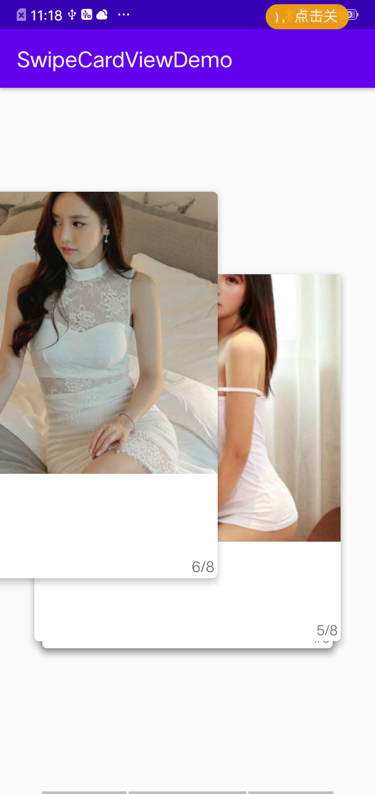

# sk_swipecardview
仿探探使用RecycleView+CardView实现360度滑动删除布局

使用方法：mainActivity

class MainActivity : AppCompatActivity() {

    lateinit var mRecyclerView: RecyclerView
    var mData: ArrayList<SwipeBean> = arrayListOf()
    
    override fun onCreate(savedInstanceState: Bundle?) {
        super.onCreate(savedInstanceState)
        setContentView(R.layout.activity_main)
        mRecyclerView = findViewById(R.id.recycle_view)
        CardConfig.initCardConfig(this)
        getData()
        println(mData.size)
        var adapter = MyAdapter(this, mData, R.layout.item_swipe_card)
        mRecyclerView.layoutManager = SwipeLayoutManager()
        mRecyclerView.adapter = adapter
    
        val callback: ItemTouchHelper.Callback = SwipeTouchCallBack(object : OnSwipeListener {
                override fun onSwipedListener(
                    viewHolder: RecyclerView.ViewHolder,
                    direction: Int
                ) {
                    val remove: SwipeBean = mData.removeAt(viewHolder.adapterPosition)
                    mData.add(0, remove)
                    adapter.notifyDataSetChanged()
                }
            }, 0, 0f)
        val touchHelper = ItemTouchHelper(callback)
        touchHelper.attachToRecyclerView(mRecyclerView)
    }
    
    private fun getData() {
        mData.addAll(DataUtil.getData())
    }
}

activity_main.xml：

<?xml version="1.0" encoding="utf-8"?>
<LinearLayout xmlns:android="http://schemas.android.com/apk/res/android"

    xmlns:app="http://schemas.android.com/apk/res-auto"
    xmlns:tools="http://schemas.android.com/tools"
    android:layout_width="match_parent"
    android:orientation="vertical"
    android:layout_height="match_parent"
    tools:context=".MainActivity">
    
    <androidx.recyclerview.widget.RecyclerView
        android:id="@+id/recycle_view"
        android:layout_width="match_parent"
        android:layout_height="match_parent">
    </androidx.recyclerview.widget.RecyclerView>

</LinearLayout>

item：

<?xml version="1.0" encoding="utf-8"?>
<androidx.cardview.widget.CardView xmlns:android="http://schemas.android.com/apk/res/android"

    xmlns:app="http://schemas.android.com/apk/res-auto"
    xmlns:tools="http://schemas.android.com/tools"
    android:layout_width="310dp"
    android:layout_height="370dp"
    android:clickable="true"
    android:foreground="?android:attr/selectableItemBackground"
    app:cardBackgroundColor="#ffffff"
    app:cardCornerRadius="5dp"
    app:cardElevation="5dp">
    
    <LinearLayout
        android:layout_width="match_parent"
        android:layout_height="match_parent"
        android:orientation="vertical">
    
        <ImageView
            android:id="@+id/iv"
            android:layout_width="match_parent"
            android:layout_height="270dp"
            android:layout_gravity="center_horizontal"
            android:scaleType="centerCrop"
            tools:src="@mipmap/ic_launcher" />

        <TextView
            android:id="@+id/tvName"
            android:layout_width="wrap_content"
            android:layout_height="0dp"
            android:layout_marginLeft="10dp"
            android:layout_weight="1"
            android:textColor="@color/colorAccent"
            android:paddingTop="10dp"
            tools:text="美女名字" />
    
        <TextView
            android:id="@+id/tvPrecent"
            android:layout_width="wrap_content"
            android:layout_height="wrap_content"
            android:layout_gravity="right|bottom"
            android:layout_margin="3dp"
            tools:text="1/1" />
    </LinearLayout>

</androidx.cardview.widget.CardView>

效果：

此demo包含kotlin model与java model两个版本，可根据您项目选择合适的使用

如果觉得好用的话给个start吧

